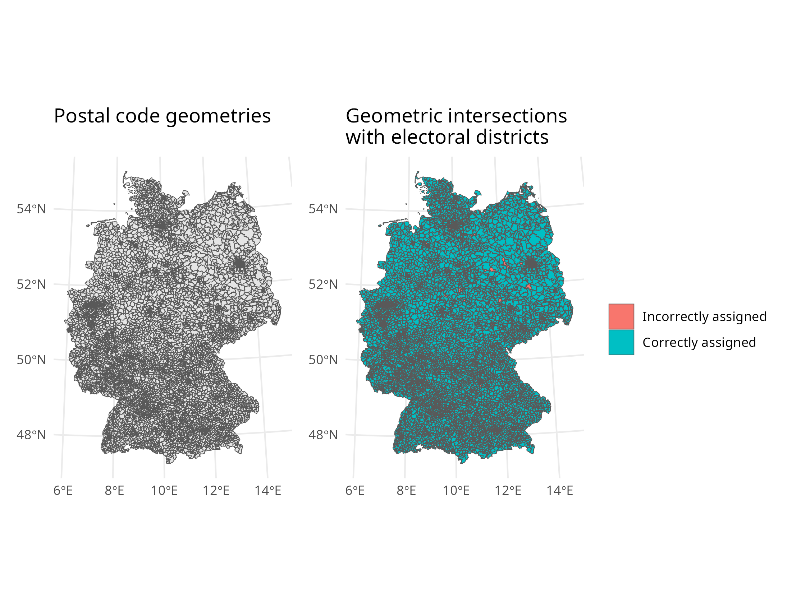
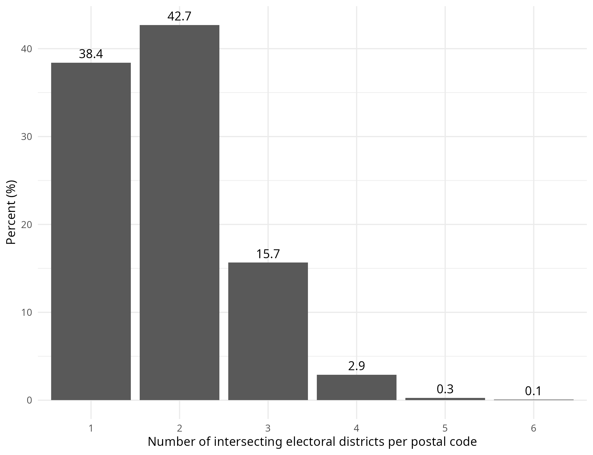
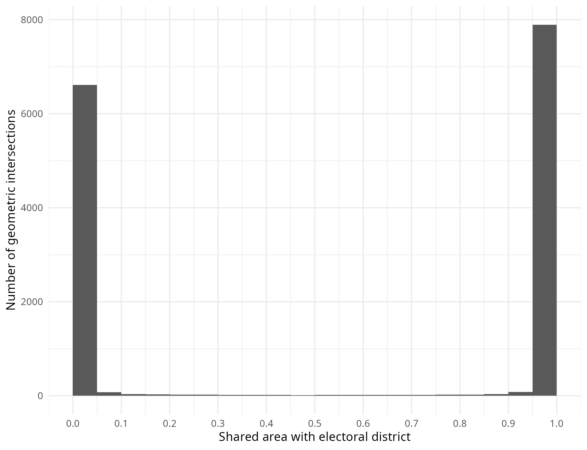

# postal-codes-to-electoral-districts

## Goal

Produce a reproducible conversion linking German postal codes (Postleitzahl / PLZ) to Bundestag electoral districts (Wahlkreise) for the 2025 federal election.

The workflow computes geometric intersections between postal code areas and electoral districts and derives:

- a **full intersection table** with overlap shares  
- a **best-match table** assigning each PLZ to the electoral district with the largest area overlap  

---

## Method summary

1. Load and clean geospatial data (`sf`)
2. Harmonize geometries and compute intersections
3. Calculate intersection areas and overlap shares
4. Rank overlaps per postal code
5. Select the district with the maximum overlap
6. Export results as CSV tables

---

## Data sources

**Postal-code geometries (GeoJSON, Brotli-compressed):** 

- Vollnhals, S. (@yetzt) (2026). _postleitzahlen_. Release: 2026.02. https://github.com/yetzt/postleitzahlen/releases/tag/2026.02  

**Electoral district geometries (shapefile ZIP):**

- Bundeswahlleiterin (2025). _Bundestagswahl 2025: Karte der Wahlkreise zum Download_. Shapefile (SHP). Geometrie der Wahlkreise im Koordinatensystem UTM32 (nicht generalisiert). https://www.bundeswahlleiterin.de/bundestagswahlen/2025/wahlkreiseinteilung/downloads.html  

---

## Outputs

### 1. Full intersection table

📄 **File:** `data/tab_intersections.csv`

Contains all geometric intersections between postal codes and electoral districts, including overlap proportions.

**Columns:**

- `intersection_id` — unique identifier (PLZ + electoral district)
- `plz` — postal code  
- `wkr_nr` — electoral district number  
- `wkr_name` — electoral district name  
- `land_nr` — federal state number  
- `land_name` — federal state name  
- `prop_overlap` — proportion of the total area of the postcode that is covered by the intersection

---

### 2. Best-match conversion table

📄 **File:** `data/tab_best_match.csv`

Assigns each postal code to the electoral district with the **largest area overlap**.

**Columns:**

- `plz` — postal code  
- `wkr_nr` — electoral district number  
- `wkr_name` — electoral district name  
- `land_nr` — federal state number  
- `land_name` — federal state name  

---

## Figures

### 1. Correct and incorrect assignments

**Note:**  
Postal code geometries (left) and their geometric intersections with electoral districts (right).  
Intersections (subareas of a postal code areas) in green are correctly matched to an electoral district. Intersections in red are incorrectly matched. 

---

### 2. Number of intersecting districts per postal code

**Note:**  
Distribution of how many electoral districts intersect with a given postal code.  
A large share of postal codes map cleanly to a single district, while some span multiple districts.

---

### 3. Distribution of overlap shares

**Note:**  
Histogram of intersections by the share of a postal code’s area covered.
The distribution is highly bimodal, with peaks near 0 and 1, indicating that most postal codes can be almost entirely assign to a single electoral district, with only small fragments overlapping neighboring districts.

---

## System prerequisites

- R ≥ 4.1  
- System libraries for `sf`: GDAL, GEOS, PROJ (install via your OS package manager)  
- Internet connection to download data sources  

---

## R packages required

* brotli 
* dplyr 
* httr2 
* readr
* sf 

For graphs: 

* ggplot2
* patchwork
